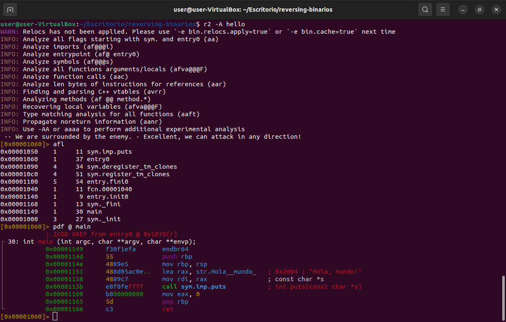
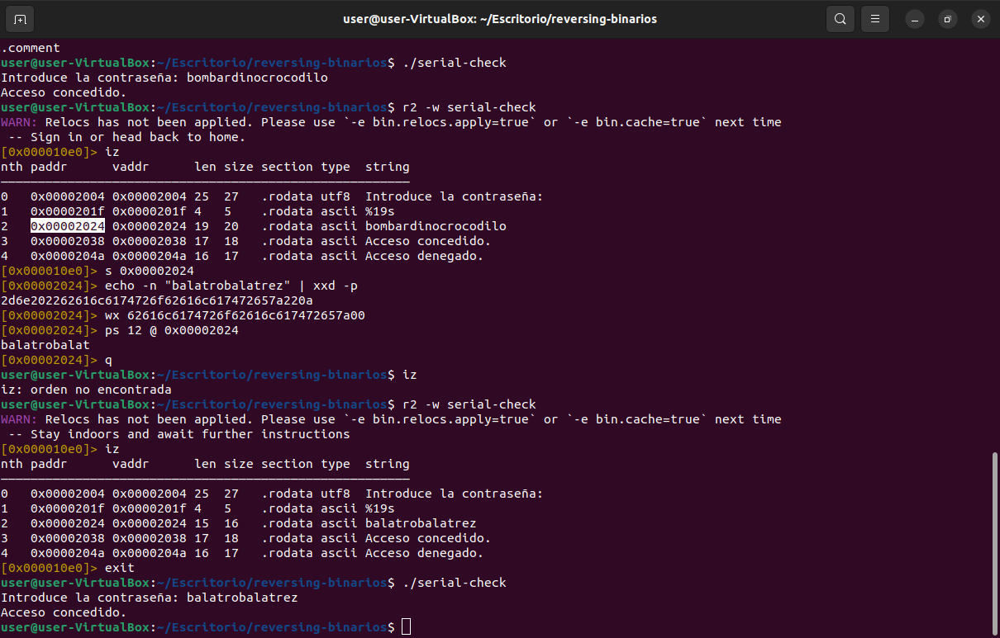

# Ejercicios con binarios

---

## Ejercicio 1 

### Compilamos y ejecutamos el hello.c

```bash
gcc -o hello hello.c
./hello
```

---

### Analizamos con objdump y strings

```bash
objdump -d hello | less  # Ver instrucciones en ensamblador
```
#### Resultado del comando con objdump

```bash
hello:     formato del fichero elf64-x86-64


Desensamblado de la sección .init:

0000000000001000 <_init>:
    1000:	f3 0f 1e fa          	endbr64 
    1004:	48 83 ec 08          	sub    $0x8,%rsp
    1008:	48 8b 05 d9 2f 00 00 	mov    0x2fd9(%rip),%rax        # 3fe8 <__gmon_start__@Base>
    100f:	48 85 c0             	test   %rax,%rax
    1012:	74 02                	je     1016 <_init+0x16>
    1014:	ff d0                	call   *%rax
    1016:	48 83 c4 08          	add    $0x8,%rsp
    101a:	c3                   	ret    

Desensamblado de la sección .plt:

0000000000001020 <.plt>:
    1020:	ff 35 9a 2f 00 00    	push   0x2f9a(%rip)        # 3fc0 <_GLOBAL_OFFSET_TABLE_+0x8>
    1026:	f2 ff 25 9b 2f 00 00 	bnd jmp *0x2f9b(%rip)        # 3fc8 <_GLOBAL_OFFSET_TABLE_+0x10>
    102d:	0f 1f 00             	nopl   (%rax)
    1030:	f3 0f 1e fa          	endbr64 
    1034:	68 00 00 00 00       	push   $0x0
    1039:	f2 e9 e1 ff ff ff    	bnd jmp 1020 <_init+0x20>
    103f:	90                   	nop

Desensamblado de la sección .plt.got:

0000000000001040 <__cxa_finalize@plt>:
    1040:	f3 0f 1e fa          	endbr64 
    1044:	f2 ff 25 ad 2f 00 00 	bnd jmp *0x2fad(%rip)        # 3ff8 <__cxa_finalize@GLIBC_2.2.5>
    104b:	0f 1f 44 00 00       	nopl   0x0(%rax,%rax,1)

Desensamblado de la sección .plt.sec:

0000000000001050 <puts@plt>:
    1050:	f3 0f 1e fa          	endbr64 
    1054:	f2 ff 25 75 2f 00 00 	bnd jmp *0x2f75(%rip)        # 3fd0 <puts@GLIBC_2.2.5>
    105b:	0f 1f 44 00 00       	nopl   0x0(%rax,%rax,1)

Desensamblado de la sección .text:

0000000000001060 <_start>:
    1060:	f3 0f 1e fa          	endbr64 
    1064:	31 ed                	xor    %ebp,%ebp
    1066:	49 89 d1             	mov    %rdx,%r9
    1069:	5e                   	pop    %rsi
    106a:	48 89 e2             	mov    %rsp,%rdx
    106d:	48 83 e4 f0          	and    $0xfffffffffffffff0,%rsp
    1071:	50                   	push   %rax
    1072:	54                   	push   %rsp
    1073:	45 31 c0             	xor    %r8d,%r8d
    1076:	31 c9                	xor    %ecx,%ecx
    1078:	48 8d 3d ca 00 00 00 	lea    0xca(%rip),%rdi        # 1149 <main>
    107f:	ff 15 53 2f 00 00    	call   *0x2f53(%rip)        # 3fd8 <__libc_start_main@GLIBC_2.34>
    1085:	f4                   	hlt    
    1086:	66 2e 0f 1f 84 00 00 	cs nopw 0x0(%rax,%rax,1)
    108d:	00 00 00 

0000000000001090 <deregister_tm_clones>:
    1090:	48 8d 3d 79 2f 00 00 	lea    0x2f79(%rip),%rdi        # 4010 <__TMC_END__>
    1097:	48 8d 05 72 2f 00 00 	lea    0x2f72(%rip),%rax        # 4010 <__TMC_END__>
    109e:	48 39 f8             	cmp    %rdi,%rax
    10a1:	74 15                	je     10b8 <deregister_tm_clones+0x28>
    10a3:	48 8b 05 36 2f 00 00 	mov    0x2f36(%rip),%rax        # 3fe0 <_ITM_deregisterTMCloneTable@Base>
    10aa:	48 85 c0             	test   %rax,%rax
    10ad:	74 09                	je     10b8 <deregister_tm_clones+0x28>
    10af:	ff e0                	jmp    *%rax
    10b1:	0f 1f 80 00 00 00 00 	nopl   0x0(%rax)
    10b8:	c3                   	ret    
    10b9:	0f 1f 80 00 00 00 00 	nopl   0x0(%rax)

00000000000010c0 <register_tm_clones>:
    10c0:	48 8d 3d 49 2f 00 00 	lea    0x2f49(%rip),%rdi        # 4010 <__TMC_END__>
    10c7:	48 8d 35 42 2f 00 00 	lea    0x2f42(%rip),%rsi        # 4010 <__TMC_END__>
    10ce:	48 29 fe             	sub    %rdi,%rsi
    10d1:	48 89 f0             	mov    %rsi,%rax
    10d4:	48 c1 ee 3f          	shr    $0x3f,%rsi
    10d8:	48 c1 f8 03          	sar    $0x3,%rax
    10dc:	48 01 c6             	add    %rax,%rsi
    10df:	48 d1 fe             	sar    %rsi
    10e2:	74 14                	je     10f8 <register_tm_clones+0x38>
    10e4:	48 8b 05 05 2f 00 00 	mov    0x2f05(%rip),%rax        # 3ff0 <_ITM_registerTMCloneTable@Base>
    10eb:	48 85 c0             	test   %rax,%rax
    10ee:	74 08                	je     10f8 <register_tm_clones+0x38>
    10f0:	ff e0                	jmp    *%rax
    10f2:	66 0f 1f 44 00 00    	nopw   0x0(%rax,%rax,1)
    10f8:	c3                   	ret    
    10f9:	0f 1f 80 00 00 00 00 	nopl   0x0(%rax)

0000000000001100 <__do_global_dtors_aux>:
    1100:	f3 0f 1e fa          	endbr64 
    1104:	80 3d 05 2f 00 00 00 	cmpb   $0x0,0x2f05(%rip)        # 4010 <__TMC_END__>
    110b:	75 2b                	jne    1138 <__do_global_dtors_aux+0x38>
    110d:	55                   	push   %rbp
    110e:	48 83 3d e2 2e 00 00 	cmpq   $0x0,0x2ee2(%rip)        # 3ff8 <__cxa_finalize@GLIBC_2.2.5>
    1115:	00 
    1116:	48 89 e5             	mov    %rsp,%rbp
    1119:	74 0c                	je     1127 <__do_global_dtors_aux+0x27>
    111b:	48 8b 3d e6 2e 00 00 	mov    0x2ee6(%rip),%rdi        # 4008 <__dso_handle>
    1122:	e8 19 ff ff ff       	call   1040 <__cxa_finalize@plt>
    1127:	e8 64 ff ff ff       	call   1090 <deregister_tm_clones>
    112c:	c6 05 dd 2e 00 00 01 	movb   $0x1,0x2edd(%rip)        # 4010 <__TMC_END__>
    1133:	5d                   	pop    %rbp
    1134:	c3                   	ret    
    1135:	0f 1f 00             	nopl   (%rax)
    1138:	c3                   	ret    
    1139:	0f 1f 80 00 00 00 00 	nopl   0x0(%rax)

0000000000001140 <frame_dummy>:
    1140:	f3 0f 1e fa          	endbr64 
    1144:	e9 77 ff ff ff       	jmp    10c0 <register_tm_clones>

0000000000001149 <main>:
    1149:	f3 0f 1e fa          	endbr64 
    114d:	55                   	push   %rbp
    114e:	48 89 e5             	mov    %rsp,%rbp
    1151:	48 8d 05 ac 0e 00 00 	lea    0xeac(%rip),%rax        # 2004 <_IO_stdin_used+0x4>
    1158:	48 89 c7             	mov    %rax,%rdi
    115b:	e8 f0 fe ff ff       	call   1050 <puts@plt>
    1160:	b8 00 00 00 00       	mov    $0x0,%eax
    1165:	5d                   	pop    %rbp
    1166:	c3                   	ret    

Desensamblado de la sección .fini:

0000000000001168 <_fini>:
    1168:	f3 0f 1e fa          	endbr64 
    116c:	48 83 ec 08          	sub    $0x8,%rsp
    1170:	48 83 c4 08          	add    $0x8,%rsp
    1174:	c3                   	ret
```
### Strings

```bash
strings hello            # Ver cadenas embebidas
```

#### Resultado del comando

```bash
/lib64/ld-linux-x86-64.so.2
__cxa_finalize
__libc_start_main
puts
libc.so.6
GLIBC_2.2.5
GLIBC_2.34
_ITM_deregisterTMCloneTable
__gmon_start__
_ITM_registerTMCloneTable
PTE1
u+UH
Hola, mundo!
:*3$"
GCC: (Ubuntu 11.4.0-1ubuntu1~22.04) 11.4.0
Scrt1.o
__abi_tag
crtstuff.c
deregister_tm_clones
__do_global_dtors_aux
completed.0
__do_global_dtors_aux_fini_array_entry
frame_dummy
__frame_dummy_init_array_entry
hello.c
__FRAME_END__
_DYNAMIC
__GNU_EH_FRAME_HDR
_GLOBAL_OFFSET_TABLE_
__libc_start_main@GLIBC_2.34
_ITM_deregisterTMCloneTable
puts@GLIBC_2.2.5
_edata
_fini
__data_start
__gmon_start__
__dso_handle
_IO_stdin_used
_end
__bss_start
main
__TMC_END__
_ITM_registerTMCloneTable
__cxa_finalize@GLIBC_2.2.5
_init
.symtab
.strtab
.shstrtab
.interp
.note.gnu.property
.note.gnu.build-id
.note.ABI-tag
.gnu.hash
.dynsym
.dynstr
.gnu.version
.gnu.version_r
.rela.dyn
.rela.plt
.init
.plt.got
.plt.sec
.text
.fini
.rodata
.eh_frame_hdr
.eh_frame
.init_array
.fini_array
.dynamic
.data
.bss
.comment
```
## Análisis

### Qué instrucciones se utilizan para imprimir la cadena?

```
1151:	48 8d 05 ac 0e 00 00 	lea    0xeac(%rip),%rax  ; carga la dirección de la cadena
1158:	48 89 c7             	mov    %rax,%rdi ; mueve la dirección a %rdi
115b:	e8 f0 fe ff ff       	call   1050 <puts@plt> ; llama a puts@plt
```
Se usa la instrucción call puts para imprimir

### Qué cadenas aparecen en el ejecutable?

- "Hola , mundo! 
- "hello.c" (nombre del archivo)
- "GCC..." (versión del compilador)
- Nombres de funciones y símbolos estándar: puts, __libc_start_main, etc.

## Radare2 en hello.c

### Direcciones de las funciones usadas mediante el comando afl

| Dirección    | Tamaño | Nombre                     | Comentario                           |
| ------------ | ------ | -------------------------- | ------------------------------------ |
| `0x00001050` | 11     | `sym.imp.puts`             | Función `puts` importada (impresión) |
| `0x00001060` | 37     | `entry0`                   | Punto de entrada del programa        |
| `0x00001090` | 34     | `sym.deregister_tm_clones` | Función generada por el compilador   |
| `0x000010c0` | 51     | `sym.register_tm_clones`   | Función generada por el compilador   |
| `0x00001100` | 54     | `entry.fini0`              | Finalizador del programa             |
| `0x00001040` | 11     | `fcn.00001040`             | Posiblemente `__cxa_finalize`        |
| `0x00001140` | 9      | `entry.init0`              | Inicializador del programa           |
| `0x00001168` | 13     | `sym._fini`                | Finalizador                          |
| `0x00001149` | 30     | `main`                     | Función principal                    |
| `0x00001000` | 27     | `sym._init`                | Inicializador estándar               |

### Análisis de la función main mediante el comando pdf @ main

```
0x00001149      endbr64                   ; Marca usada para protección (Intel CET)
0x0000114d      push rbp                  ; Guarda el marco de pila anterior
0x0000114e      mov rbp, rsp              ; Prepara el nuevo marco de pila
0x00001151      lea rax, [rip + 0xeac]    ; Carga dirección de "Hola, mundo!" (en 0x2004)
0x00001158      mov rdi, rax              ; Argumento para puts (cadena a imprimir)
0x0000115b      call sym.imp.puts         ; Llama a puts()
0x00001160      mov eax, 0                ; Devuelve 0 (éxito)
0x00001165      pop rbp                   ; Restaura marco de pila
0x00001166      ret                       ; Retorna al SO
```



## Conclusión

- La función main imprime la cadena "Hola, mundo!" usando puts.
- La dirección de esa cadena es 0x2004
- Devuelve 0 para que se sepa que se ha ejecutado bien

## Ejercicio 2
Analizo los ejecutables mindreader y mindreader2 para intentar averiguar si están compilados en C o en python.

Para ello hago uso de "file", "strings" y "radare2"

### mindreader

Empezamos el análisis de mindreader usando

```bash
file mindreader
```
nos escupe un resultado tal que así

```
mindreader: ELF 64-bit LSB pie executable, x86-64, version 1 (SYSV), dynamically linked, interpreter /lib64/ld-linux-x86-64.so.2, BuildID[sha1]=94c7e7e4032773887c247ee4255810d5527b661f, for GNU/Linux 3.2.0, not stripped
```

De aquí ya podemos sacar varias cosas realmente interesantes:

- PIE (Position Independent Executable) Normal para binarios modernos compilados en C/C++.
- Dynamically linked: Enlaza con bibliotecas como libc.so.6, muy típico de C.
- Interpreter: /lib64/ld-linux-x86-64.so.2: clásico en ejecutables de C/C++, no en PyInstaller.
- not stripped: Contiene símbolos — útil para análisis con radare2.
- No menciona Python por ningún lado

Con este análisis inicial podemos decantarnos porque va a ser un ejecutable compilado en C pero vamos a ir más a fondo.

#### Strings y Radare2

Hago uso del siguiente comando

```bash
strings mindreader | less
```

Nos da como resultado esto:

```
/lib64/ld-linux-x86-64.so.2
mgUa
fgets
stdin
puts
__stack_chk_fail
time
strcspn
__libc_start_main
srand
__cxa_finalize
strcmp
libc.so.6
GLIBC_2.4
GLIBC_2.2.5
GLIBC_2.34
_ITM_deregisterTMCloneTable
__gmon_start__
_ITM_registerTMCloneTable
PTE1
u+UH
manzana
naranja
tano
cereza
fresa
sand
pera
kiwi
Password: 
La flag es NOTNULL
Acceso denegado
9*3$"
GCC: (Ubuntu 13.3.0-6ubuntu2~24.04) 13.3.0
Scrt1.o
__abi_tag
crtstuff.c
deregister_tm_clones
__do_global_dtors_aux
completed.0
__do_global_dtors_aux_fini_array_entry
frame_dummy
__frame_dummy_init_array_entry
mindreader.c
__FRAME_END__
_DYNAMIC
__GNU_EH_FRAME_HDR
_GLOBAL_OFFSET_TABLE_
__libc_start_main@GLIBC_2.34
_ITM_deregisterTMCloneTable
puts@GLIBC_2.2.5
stdin@GLIBC_2.2.5
_edata
_fini
__stack_chk_fail@GLIBC_2.4
strcspn@GLIBC_2.2.5
srand@GLIBC_2.2.5
fgets@GLIBC_2.2.5
__data_start
strcmp@GLIBC_2.2.5
__gmon_start__
_IO_stdin_used
time@GLIBC_2.2.5
_end
__bss_start
main
__TMC_END__
palabras
_ITM_registerTMCloneTable
__cxa_finalize@GLIBC_2.2.5
_init
adivinar_palabra
.symtab
.strtab
.shstrtab
.interp
.note.gnu.property
.note.gnu.build-id
.note.ABI-tag
.gnu.hash
.dynsym
.dynstr
.gnu.version
.gnu.version_r
.rela.dyn
.rela.plt
.init
.plt.got
.plt.sec
.text
.fini
.rodata
.eh_frame_hdr
.eh_frame
.init_array
.fini_array
.dynamic
.data
.bss
.comment
```

De aquí podemos sacar por ejemplo la presencia de "puts" algo muy común en programas compilados en C, nombres de funciones y ausencia de cualquier py*, evidencias de que este ejecutable no debe de haber sido compilado con Python.

Pero por último haremos uso de radare2, con el comando de afl si encuentro:

- main
- funciones nombradas
- funciones tipo sym.*

Podríamos decir con casi total seguridad que es un archivo compilado con C


Dado el resultado podemos afirmar que minreader es un archivo compilado en C y no en Python

### mindreader2

Empezamos el análisis de mindreader usando

```bash
file mindreader2
```
nos escupe un resultado tal que así

```
mindreader2: ELF 64-bit LSB executable, x86-64, version 1 (SYSV), dynamically linked, interpreter /lib64/ld-linux-x86-64.so.2, for GNU/Linux 3.2.0, BuildID[sha1]=fc89f558d158bb1cc6e5e463d6fe7c536da15abb, stripped
```

Al contrario que el anterior no nos da ningún tipo de pista acerca de si es compilado en C o en Python, por lo tanto seguimos con el resto de comprobaciones.

#### Strings y Radare2

```bash
strings mindreader2
```

Al buscar dentro de las cadenas internar podemos resaltar estas de aquí:

```
__main__
__name__
__file__
marshal
Py_Initialize
PyRun_SimpleString
Python.h
code object
```

Estas cadenas nos indican:
- Uso de la API de Python embebido
- Elementos típicos de programas generados desde scripts .py
- Probablemente fue generado con herramientas como pyinstaller

Hacemos uso de Radare2 para terminar de confirmar:

```bash
r2 -A mindreader2
afl
```


podemos ver que claramente hay:
- Pocas funciones simbólicas claras como main
- Muchas referencias a funciones tipo Py_*
- No hay estructuras lógicas como las que un compilador C genera (main, printf, etc.)

Todo esto es característico de un ejecutable compilado con Python haciendo uso de una herramienta como Pyinstaller por ejemplo.

## Ejercicio 3

Intentamos conseguir la flag de forma legitima sin mirarla con strings, para esto hacemos uso de radare2:

```bash
r2 -d ./mindreader
aaa
afl
pdf @ main
```
Dentro de main vamos a utilizar el debugger, pararemos el proceso en el momento en el que el rdi contiene la contraseña que nos dará posteriormente la flag


## Ejercicio 4

Debemos analizar el ejecutable serial-check e intentar obtener acceso a la aplicación, como no nos han puesto restricciones haré uso directamente de strings a ver si puedo ver la contraseña en plano, spoiler se ve:

```bash
strings serial-check
```

Esto nos da como resultado:

```
/lib64/ld-linux-x86-64.so.2
puts
__stack_chk_fail
__libc_start_main
__cxa_finalize
printf
__isoc99_scanf
strcmp
libc.so.6
GLIBC_2.7
GLIBC_2.4
GLIBC_2.2.5
GLIBC_2.34
_ITM_deregisterTMCloneTable
__gmon_start__
_ITM_registerTMCloneTable
PTE1
u+UH
Introduce la contrase
%19s
bombardinocrocodilo
Acceso concedido.
Acceso denegado.
9*3$"
GCC: (Ubuntu 13.3.0-6ubuntu2~24.04) 13.3.0
Scrt1.o
__abi_tag
crtstuff.c
deregister_tm_clones
__do_global_dtors_aux
completed.0
__do_global_dtors_aux_fini_array_entry
frame_dummy
__frame_dummy_init_array_entry
check_password.c
__FRAME_END__
_DYNAMIC
__GNU_EH_FRAME_HDR
_GLOBAL_OFFSET_TABLE_
__libc_start_main@GLIBC_2.34
_ITM_deregisterTMCloneTable
puts@GLIBC_2.2.5
_edata
_fini
__stack_chk_fail@GLIBC_2.4
printf@GLIBC_2.2.5
__data_start
strcmp@GLIBC_2.2.5
__gmon_start__
__dso_handle
_IO_stdin_used
_end
__bss_start
main
__isoc99_scanf@GLIBC_2.7
__TMC_END__
_ITM_registerTMCloneTable
__cxa_finalize@GLIBC_2.2.5
_init
.symtab
.strtab
.shstrtab
.interp
.note.gnu.property
.note.gnu.build-id
.note.ABI-tag
.gnu.hash
.dynsym
.dynstr
.gnu.version
.gnu.version_r
.rela.dyn
.rela.plt
.init
.plt.got
.plt.sec
.text
.fini
.rodata
.eh_frame_hdr
.eh_frame
.init_array
.fini_array
.dynamic
.data
.bss
.comment
```

Podemos ver claramente que la contraseña es bombardinocrocodilo


## Ejercicio 5

Modifica el ejecutable de serial-check para que acepte el serial pass1234 (tambien conocido como balatrobalatrez)

